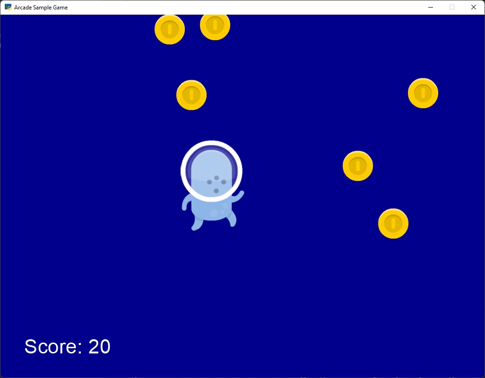

# Coin Eater Alien

- The player is a single sprite on the screen, controlled by moving the mouse.
- At regular intervals, coins appear on the screen one by one.
- As the player moves over each coin, it disappears and the player is awarded ten points.
- As the game progresses, coins are added more quickly.
- The game ends when there are more than ten coins visible on the screen.

