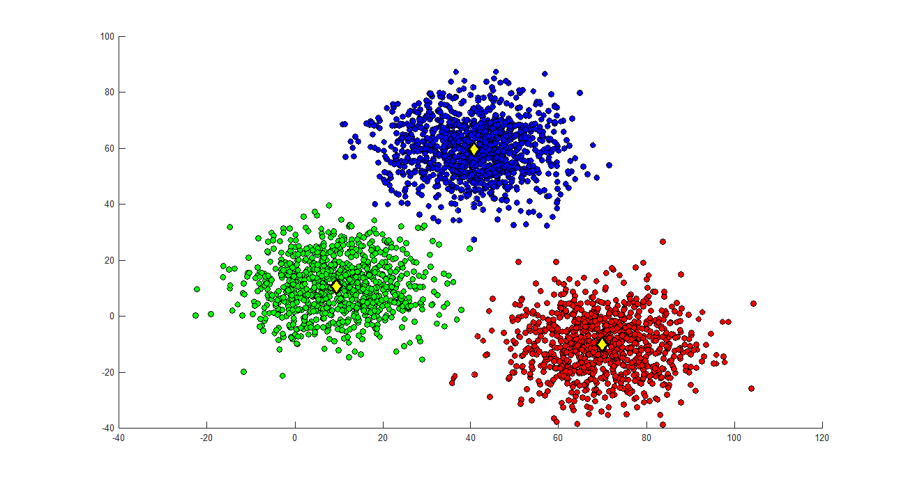
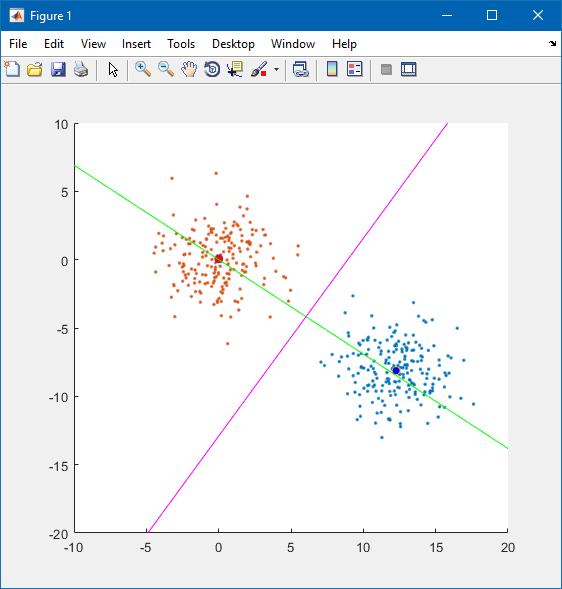

# Classic Machine Learning Algorithms

Implement famous machine learning algorithms from scratch with the help of mathematical equations

- Fuzzy C Means Clustering with Python and Matlab
- Kernel Fisher’s Discriminant with heterogeneous kernels with Python and Matlab
- Linear Regression with Python and Matlab
- Least Mean Squares learning algorithm for Radial Basis Function Kernels with Matlab
- Soft Margin Support Vector Machine with Matlab
- Support Vector Regression with Matlab

FCM clustering | Fisher Classification | Linear Regression
--- | --- | --- |
 |  |  |

LMS for RBF | Soft Margin SVM | SVR
--- | --- | --- |
 |  |  |
