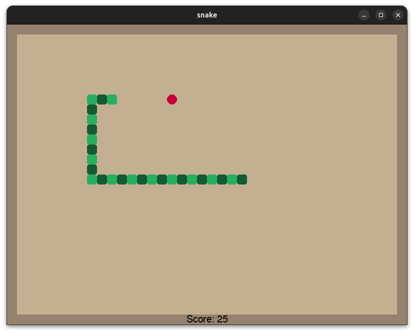

# Snake AI

[](https://github.com/SajjadAemmi/Snake-AI/actions/workflows/python-app.yml)
[](https://github.com/SajjadAemmi/Snake-AI/actions/workflows/python-package.yml)

Snake game with artificial intelligence written in python using pygame library and trained with pytorch.



# Train
Use the following command for generate eight neighborhoods csv dataset:

```
python generate_dataset_8_direction.py --count 1000000
```

Use the following command for train model:

```
python train.py --epochs 8
```


# Run
Use the following command for run game with machine learning inference:

```
python main_machine_learning.py --weights ./weights/snake.pt
```

Use the following command for run game with classic rule based AI inference:

```
python main_rule_based.py
```
